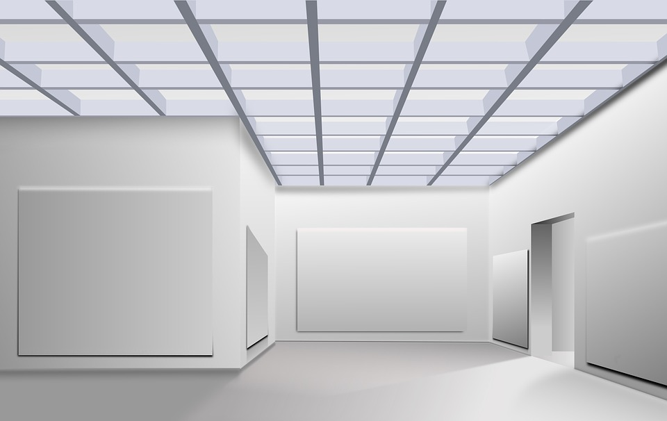

> **NOTE: ALPHA Release**
> This is not fully complete. It's mostly clipped verbatim from a theme I'm working on. It may be useful in its current state, but no promises... yet.

# Boilerplate for creating User Styles

[](https://github.com/simsrw73/boilerplate-userstyle-theme/raw/master/release/theme.user.css)
[](https://github.com/simsrw73/boilerplate-userstyle-theme/raw/master/release/theme.user.js)

Boilerplate for creating user styles for website themes


### Table of Contents
**[Using the Theme](#using-the-theme)**<br>
**[Modifying the Theme](#modifying-the-theme)**<br>
**[See Also](#see-also)**<br>
**[Gallery](#gallery)**<br>

## Using the Theme

### Install A Browser Plugin

There are a couple of options for installing the theme in your browser.

[ Stylus](https://add0n.com/stylus.html) is a browser extension for Chrome, Firefox, and Opera that allows you to override the styling of websites, to change their appearance.

  * [Stylus for Chrome](https://chrome.google.com/webstore/detail/clngdbkpkpeebahjckkjfobafhncgmne)
  * [Stylus for Firefox](https://addons.mozilla.org/firefox/addon/styl-us/)
  * [Stylus for Opera](https://addons.opera.com/extensions/details/stylus/)


[ Tampermonkey](http://tampermonkey.net/) is a browser extension for Chrome, Firefox, Edge, Opera, and Safari that allows running scripts to change the behavior of websites and add new functionality.

  * [Tampermonkey for Chrome](https://chrome.google.com/webstore/detail/dhdgffkkebhmkfjojejmpbldmpobfkfo)
  * [Tampermonkey for Firefox](https://addons.mozilla.org/en-US/firefox/addon/tampermonkey/)
  * [Tampermonkey for Edge](https://www.microsoft.com/store/apps/9NBLGGH5162S)
  * [Tampermonkey for Opera](https://addons.opera.com/en/extensions/details/tampermonkey-beta/)
  * [Tampermonkey for Safari](https://safari.tampermonkey.net/tampermonkey.safariextz)

> **Note:**
> Stylish is no longer supported, nor endorsed. What used to be a well known and respected extension was sold and resold and ended up in the hands of an analytics company that captures and transmits your browsing history. Fortunately there are now better options. The Stylish extension and the UserStyles.org website are no longer needed for this theme.


### Install the Theme

Once you've installed one of the extensions above, you are ready to install the theme:

  * From its home page at [OpenUserCSS](https://openusercss.org/)

Or directly from here:

  * For Stylus users:<br>
[](https://github.com/simsrw73/boilerplate-userstyle-theme/raw/master/release/theme.user.css)

  * For Tampermonkey users:<br>
[](https://github.com/simsrw73/boilerplate-userstyle-theme/raw/master/release/theme.user.js)

## Modifying the Theme

### Install Build Tools

  - [git](https://git-scm.com/downloads)
  - [Node.js](https://nodejs.org/en/)

### Clone the Repository

```shell
git clone https://github.com/simsrw73/boilerplate-userstyle-theme.git my-theme
```

### Install Build Dependencies

```shell
cd my-theme
npm install
```

### Build your Theme

```shell
npm run build
```

Or, to continuously monitor changes and automatically rebuild:

```shell
npm run watch
```

### Test your Theme

Load the theme in to your browser with the Stylus extension by either: dragging the file **"theme.user.css"** to your browser or using the Open Dialog in the browser (Ctrl-o). When Stylus opens the install window, check the options ***Check for updates*** and ***Live reload***, and then click the **Install style** button.


### Release your Theme

Build the final relase version of the theme:

```shell
npm run release
```


### Import the Theme to the Browser Plugin

Stylus is the best option for development. It has a feature, Live Reload, that detects changes to the file on disk and reloads the changes.

See [Installation](https://github.com/openstyles/stylus/wiki/Usercss#installation) in Stylus documentation.

> **Note:***
> For Chrome, permissions need to be enabled for Live Reload to work. Go to the Extensions page and Click on "Details" for the Stylus extension. Scroll down and enable "Allow access to file URLs"


## See Also

Related themes, scripts, extensions.

Find more custom themes at [OpenUserCSS](https://openusercss.org/).

## Gallery


